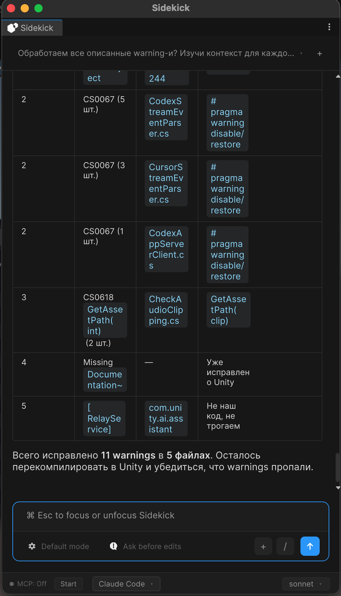
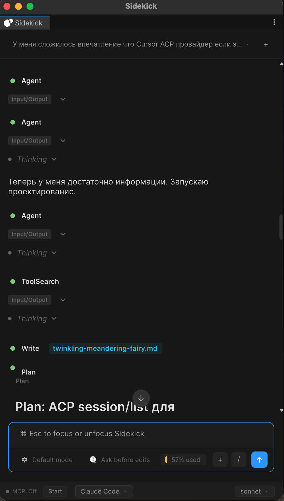
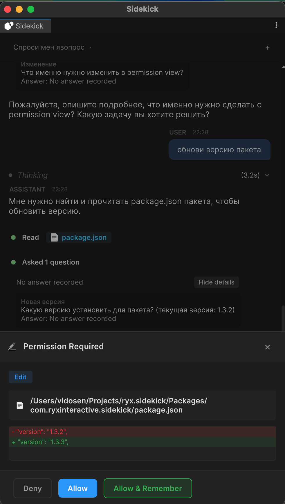

<div align="center">


# Ryx Sidekick

### Your AI coding agent, inside the Unity Editor.

Chat with **Claude** right in Unity — Unity-native context, streaming replies, and safe, reviewable edits.

[](LICENSE)
[](https://unity.com)
[](https://github.com/Vidosen/ryx-sidekick-lite/releases)
[](https://ryx-sidekick.pro/?from=github-readme)

<br/>


&nbsp;

&nbsp;


</div>

---

**Ryx Sidekick** integrates the **Claude Code CLI** directly into the Unity Editor. Bring your
own Claude subscription or API key, attach project and scene context, and review every edit
before it touches your files.

## ✨ Features

- **💬 Streaming chat** — incremental `stream-json` responses, rendered with full Markdown (code blocks, tables, links).
- **📎 Unity-native context** — attach files, the current selection, and GameObjects (hierarchy path + components) so the agent understands your project.
- **🛡️ Safe, reviewable edits** — a permission prompt for every controlled action, plus **Files** and **Diff** tabs with per-file revert.
- **🖼️ Image attachments** — paste, drag & drop, or capture Scene / Game View screenshots, with a zoom & pan overlay.
- **🗂️ CLI-native history** — browse past conversations straight from the CLI's local store (read-only — your history files are never modified).
- **⌨️ Command palette** — a VS Code-style palette that also auto-discovers the CLI's slash commands.
- **🧠 Models & extended thinking** — pick Sonnet / Opus / Haiku (or a custom model) and toggle extended thinking.
- **🔌 MCP for Unity** *(optional)* — deeper, tool-like workflows via a generated or custom MCP config.

## ✅ Requirements

- **Unity 6000.0+** (Unity 6)
- The **Claude Code CLI** (`claude` on your `PATH`)
- An authenticated Claude setup (Claude.ai, a Console API key, or AWS Bedrock)

> Dependencies (`com.unity.dt.app-ui`, `com.unity.nuget.newtonsoft-json`) resolve automatically
> from the Unity registry — no scoped registry required.

## 📦 Installation

<details open>
<summary><b>Option A — Package Manager (git URL) · recommended</b></summary>

<br/>

In Unity: **Window → Package Manager → ➕ → Add package from git URL…** and paste:

```
https://github.com/Vidosen/ryx-sidekick-lite.git#v2.4.0
```

Or add it to `Packages/manifest.json`:

```json
"com.ryxinteractive.sidekick": "https://github.com/Vidosen/ryx-sidekick-lite.git#v2.4.0"
```

Omit `#v2.4.0` to track the default branch.

</details>

<details>
<summary><b>Option B — .unitypackage</b></summary>

<br/>

Download `RyxSidekick-Lite-Plain-2.4.0.unitypackage` from the
[latest release](https://github.com/Vidosen/ryx-sidekick-lite/releases/latest) and import it via
**Assets → Import Package → Custom Package…**

</details>

## 🚀 Quick start

1. **Project Settings → Ryx Sidekick** → click **Validate CLI** (fix **CLI Path** if validation fails).
2. **Window → Ryx Sidekick** → log in if prompted.
3. Add context (files, selection, screenshots), type, and chat.

Full guide: [Documentation~/index.md](Documentation~/index.md).

## ⭐ Ryx Sidekick Pro

Lite ships the **Claude** provider. **[Ryx Sidekick Pro](https://ryx-sidekick.pro/?from=github-readme)**
adds the **Cursor** and **Codex** CLI providers and live MCP server management — one window,
your choice of agent.

## 🤝 Contributing

PRs welcome — see [CONTRIBUTING.md](CONTRIBUTING.md). All contributors sign our
[Contributor License Agreement](CLA.md) (a bot prompts you on your first pull request); this
keeps Ryx Sidekick available under both open-source and commercial editions.

## 📄 License

[GNU General Public License v3.0](LICENSE). This is an open-core project: the same code is also
distributed by Ryx Interactive on the Unity Asset Store under the Asset Store EULA — both
offered by the copyright holder.

- Branding & icon assets are proprietary and **not** covered by the GPL — see [NOTICE.md](NOTICE.md).
- Bundled third-party components keep their own licenses — see [Third-Party Notices.txt](Third-Party%20Notices.txt).
